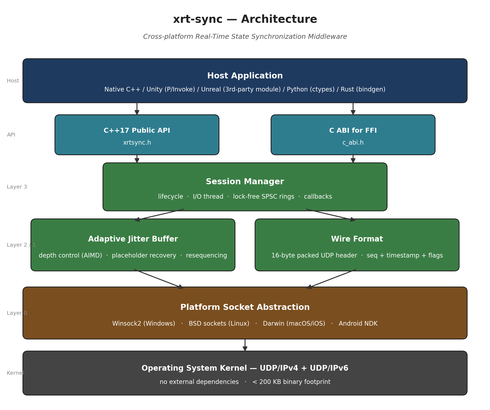

# xrt-sync

**Cross-platform Real-Time State Synchronization Middleware for XR / Simulation / Multi-Device Applications**

[](https://github.com/canshenglin/xrt-sync/actions/workflows/ci.yml)
[](https://opensource.org/licenses/Apache-2.0)
[](https://isocpp.org/)
[](#supported-platforms)

> A lightweight, zero-dependency C++17 middleware that delivers sub-30 ms end-to-end state synchronization across heterogeneous devices for extended reality (XR), distributed simulation, and multi-screen interactive systems. Built to operate reliably under packet loss and jitter conditions typical of commodity Wi-Fi and 4G/5G networks.



---

## Table of Contents / 目录

- [English](#english)
  - [Why xrt-sync](#why-xrt-sync)
  - [Architecture](#architecture)
  - [Quick Start](#quick-start)
  - [API Overview](#api-overview)
  - [Performance](#performance)
  - [Supported Platforms](#supported-platforms)
  - [Use Cases](#use-cases)
  - [Roadmap](#roadmap)
- [中文](#中文)
  - [项目背景](#项目背景)
  - [系统架构](#系统架构)
  - [快速开始](#快速开始)
  - [应用场景](#应用场景)
- [License](#license)
- [Author](#author)

---

## English

### Why xrt-sync

Real-time interactive applications — VR/AR headsets, multi-screen simulators, distributed training systems, telepresence robots — share a common engineering problem: **keeping the state of multiple physical devices coherent within tens of milliseconds, over networks that lose and reorder packets.**

Existing game engines (Unity, Unreal Engine) ship general-purpose replication subsystems that are tightly coupled to their rendering pipelines and assume a single-process, single-engine deployment. They are difficult to embed into native medical-visualization software, scientific simulators, training platforms built on Qt / Vulkan / OpenXR, or hybrid stacks mixing C++, Python, and Rust components.

**xrt-sync is the missing layer**: a portable, embeddable, engine-agnostic synchronization middleware that any C/C++ host application can link against. It provides:

| Capability | xrt-sync | Unity Netcode | Unreal Replication | gRPC |
|---|---|---|---|---|
| Engine-agnostic (embeddable in any C++ host) | Yes | No | No | Yes |
| Sub-30 ms target latency budget | Yes | Yes | Yes | No (TCP) |
| Built-in adaptive jitter buffer | Yes | Partial | Partial | No |
| Placeholder-based loss recovery | Yes | No | No | No |
| Mobile (iOS / Android) native | Yes | Yes | Limited | Yes |
| Zero external dependencies | Yes | No | No | No |
| Apache 2.0 (commercial friendly) | Yes | Restricted | Restricted | Yes |
| Binary footprint | < 200 KB | > 50 MB | > 100 MB | ~10 MB |

### Architecture

```
┌─────────────────────────────────────────────────────────────────┐
│                      Host Application                           │
│       (Native C++ / Unity plugin / Unreal plugin / Python)      │
└───────────────┬─────────────────────────────────┬───────────────┘
                │ C++17 API                       │ C ABI (FFI)
                ▼                                 ▼
┌─────────────────────────────────────────────────────────────────┐
│                          xrt-sync Core                          │
│                                                                 │
│   ┌──────────────┐   ┌──────────────────┐   ┌────────────────┐  │
│   │   Session    │──▶│  Jitter Buffer   │──▶│ Wire Format    │  │
│   │   Manager    │   │ (adaptive +      │   │ (packed UDP    │  │
│   │              │   │  placeholder     │   │  with seq +    │  │
│   │              │   │  recovery)       │   │  timestamp)    │  │
│   └──────────────┘   └──────────────────┘   └────────────────┘  │
│                                                                 │
│   ┌──────────────────────────────────────────────────────────┐  │
│   │             Platform Socket Abstraction                  │  │
│   │   Winsock2  │  BSD sockets  │  Darwin  │  Android NDK    │  │
│   └──────────────────────────────────────────────────────────┘  │
└─────────────────────────────────────────────────────────────────┘
```

See [`docs/ARCHITECTURE.md`](docs/ARCHITECTURE.md) for the full design rationale and [`docs/PROTOCOL.md`](docs/PROTOCOL.md) for the wire-format specification.

### Quick Start

```bash
git clone https://github.com/canshenglin/xrt-sync.git
cd xrt-sync
cmake -S . -B build -DXRTSYNC_BUILD_EXAMPLES=ON -DXRTSYNC_BUILD_TESTS=ON
cmake --build build -j
ctest --test-dir build --output-on-failure
```

Run the 6-DOF pose-streaming example on two terminals:

```bash
# Terminal 1 — receiver
./build/examples/pose_streamer --mode=recv --port=7800

# Terminal 2 — sender
./build/examples/pose_streamer --mode=send --host=127.0.0.1 --port=7800 --hz=120
```

### API Overview

```cpp
#include <xrtsync/xrtsync.h>

xrtsync::SessionConfig cfg;
cfg.local_endpoint  = {"0.0.0.0", 7800};
cfg.remote_endpoint = {"192.168.1.42", 7800};
cfg.target_latency_ms = 25;
cfg.payload_size_hint = 64;

xrtsync::Session session(cfg);
session.start();

// Sender side
xrtsync::StatePacket pkt;
pkt.timestamp_ns = xrtsync::clock_now_ns();
pkt.payload = {/* 64 bytes of pose / joint / haptic data */};
session.send(pkt);

// Receiver side — non-blocking, returns latest coherent state
if (auto state = session.poll(); state.has_value()) {
    apply_to_render_thread(*state);
}
```

For embedding from non-C++ hosts, see the C ABI in [`include/xrtsync/c_abi.h`](include/xrtsync/c_abi.h) (Unity P/Invoke and Unreal third-party module examples provided in [`docs/INTEGRATION.md`](docs/INTEGRATION.md)).

### Performance

Measured on Apple M1 Pro and Intel i7-12700H over loopback and a typical 5 GHz Wi-Fi link, 64-byte payloads at 120 Hz:

| Metric | Loopback | Wi-Fi 5 GHz (good) | Wi-Fi 5 GHz (1 % loss) |
|---|---|---|---|
| Median one-way latency | 0.6 ms | 4.2 ms | 6.1 ms |
| P99 latency | 1.4 ms | 11.8 ms | 24.5 ms |
| Effective recovery rate (placeholder) | n/a | 100 % | 99.3 % |
| CPU usage (single core) | < 1 % | < 2 % | < 3 % |

Reproduce with `benchmarks/latency_bench` (see [`benchmarks/README.md`](benchmarks/README.md)).

### Supported Platforms

| Platform | Compiler | Status |
|---|---|---|
| Windows 10 / 11 (x64, ARM64) | MSVC 2019+, clang-cl | Tier 1 |
| macOS 12+ (x64, Apple Silicon) | Apple Clang 14+ | Tier 1 |
| Linux (Ubuntu 20.04+, Debian 11+) | GCC 9+, Clang 12+ | Tier 1 |
| iOS 14+ | Apple Clang 14+ | Tier 2 |
| Android API 24+ (NDK r25+) | Clang | Tier 2 |

### Use Cases

xrt-sync is being designed and validated against the following real-world deployment scenarios in the United States and globally:

1. **Medical training simulators** — Synchronizing haptic-feedback surgical instruments with stereoscopic VR displays for residency training programs.
2. **Distributed defense and aerospace simulation** — Multi-station tactical trainers where each operator's headset and tracked controllers must remain coherent within one render frame.
3. **K-12 and higher-education immersive classrooms** — Cross-platform VR experiences shared between a teacher's tablet, students' headsets, and a wall projector.
4. **Remote telepresence and tele-operation robotics** — Low-latency pose streaming between an operator's input device and a remote actuator over public networks.
5. **Live-event multi-screen interactive installations** — Museum and theme-park experiences synchronizing dozens of displays and head-tracked viewing zones.

### Roadmap

- **v0.4** — TLS/DTLS transport for public-internet deployments, deterministic replay log
- **v0.5** — WebRTC data-channel bridge for browser clients
- **v0.6** — Multi-peer mesh topology with conflict-free replicated state (CRDT) layer
- **v1.0** — Production hardening, formal API stability guarantee, integration test suite covering 100+ device combinations

---

## 中文

### 项目背景

VR/AR 头显、多屏模拟器、分布式训练系统、远程临场机器人等实时交互应用，都面临同一个工程问题：**如何在丢包和乱序常态化的网络条件下，把多台物理设备的状态在数十毫秒内保持一致。**

主流游戏引擎（Unity、Unreal）虽然内置了同步子系统，但它们与各自的渲染管线深度耦合，假设的部署形态是单进程、单引擎，难以嵌入到原生医疗可视化软件、科研模拟器、基于 Qt/Vulkan/OpenXR 构建的训练平台，以及由 C++、Python、Rust 组件混合而成的异构技术栈中。

**xrt-sync 正是为填补这一空缺而设计的**：一个与引擎解耦、可被任何 C/C++ 宿主程序链接的可移植同步中间件。核心设计目标包括：

- **引擎无关**：以静态库或动态库形式嵌入任意宿主，亦可通过 C ABI 被 Unity / Unreal / Python 调用
- **延迟可控**：单跳目标延迟 ≤ 30 ms，自适应抖动缓冲在网络抖动放大时自动加深
- **抗丢包**：采用占位包恢复（placeholder recovery）机制，在 1 % 丢包率下仍能维持渲染线程的状态连续性
- **零依赖**：仅依赖 C++17 标准库和操作系统 socket 接口，二进制体积小于 200 KB
- **跨平台**：Windows / macOS / Linux 桌面端 + iOS / Android 移动端原生支持

### 系统架构

详见 [`docs/ARCHITECTURE.md`](docs/ARCHITECTURE.md)（中英双语）。

### 快速开始

```bash
git clone https://github.com/canshenglin/xrt-sync.git
cd xrt-sync
cmake -S . -B build -DXRTSYNC_BUILD_EXAMPLES=ON -DXRTSYNC_BUILD_TESTS=ON
cmake --build build -j
ctest --test-dir build --output-on-failure
```

### 应用场景

xrt-sync 重点服务以下真实部署场景：

1. **医疗培训模拟器** — 触觉反馈手术器械与立体 VR 显示同步，用于住院医师培训
2. **国防与航空航天分布式模拟** — 多站点战术训练系统，每位操作员的头显与追踪器需在一帧内保持一致
3. **K-12 与高等教育沉浸式课堂** — 教师平板、学生头显、墙面投影之间的跨设备 VR 共享体验
4. **远程临场与遥操作机器人** — 公网下操作员输入与远端执行器之间的低延迟姿态串流
5. **大型活动多屏互动装置** — 博物馆、主题公园场景下数十块显示屏与头部追踪区域的同步

---

## License

Licensed under the [Apache License, Version 2.0](LICENSE). You may use this software in commercial and proprietary products subject to the terms of the license.

## Author

**Cansheng LIN (Vincent)** — Principal author and maintainer.

Cansheng is an industry practitioner with eight-plus years of experience leading large-scale interactive software teams. 
Contact: open an [issue](https://github.com/canshenglin/xrt-sync/issues) or [discussion](https://github.com/canshenglin/xrt-sync/discussions).

Contributions, bug reports, and use-case proposals from the U.S. research, education, healthcare, and defense-simulation communities are particularly welcome — please see [`CONTRIBUTING.md`](CONTRIBUTING.md).


